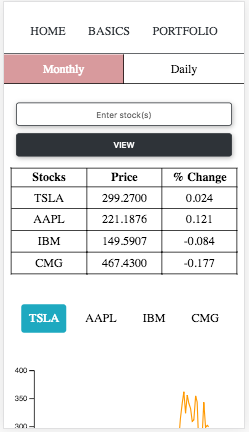
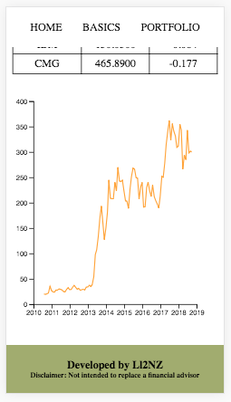

# Screenshots (mobile view)

# Visit the site
1. This site is a previous iteration of the app: https://ll2nz.github.io/securities-app/
2. I'm hoping to release the new iteration soon.

# A stock market web app
1. Query single/multiple stock(s).
2. Each query will show you a table with the latest monthly/daily adjusted price for each stock.
3. Invalid stock entries will be removed by default and only valid entries will shown.

# Using the app
1. Supply a single stock ticker: TSLA.
2. Or supply multiple valid stock tickers seperated by a comma: TSLA, AAPL, IBM, KO, ....