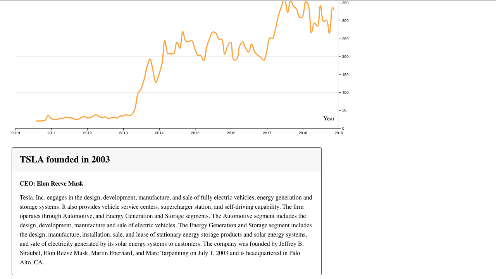

# Previous iteration of app

## Desktop display

## Mobile display

# Current version of application

## Desktop Display

# NOTE
+ If you clone the repo, you must claim your [FREE API KEY](https://www.alphavantage.co/support/#api-key).
+ I am not affiliated with alphavantage.
+ Go to the file: `src/js/Redux/Actions/fetchData.js`. In there, you'll find the following line of code:
`fetch(https://www.alphavantage.co/query?${frequency}symbol=${stock}&apikey=${process.env.API_KEY})`.
    + Replace `&apikey=${process.env.API_KEY}` with `&apikey=YOUR_FREE_API_KEY`
+ Or just create a new environment variable named `API_KEY`, which stores your free api key details.

# Using the app
+ Supply a single stock ticker: TSLA.
+ Each query will show you a table with stock info: Price, Market Cap, etc...
+ Each query will give you a description of the company, when it was founded, and current CEO.
+ Each query will show you a graph of stock price over time.
+ Each result will be stored, and you'll be able to toggle between all stocks you queried.

# App Errors/Warnings/Duplicate-Entries
+ __Duplicate-Entries__: If you enter a stock already in state, that stock won't be retrieved.
+ __Errors__: Invalid stock entries will be removed and an error will be thrown.
+ __Warnings__: If you make too many consecutive calls, a warning will be thrown instructing you to: "wait a few seconds and try again."

# Reminders
+ Implement error action creator: redux.
+ Rework UI
+ Start bundle splitting.

# Disclaimer
+ Not intended to replace a financial advisor
