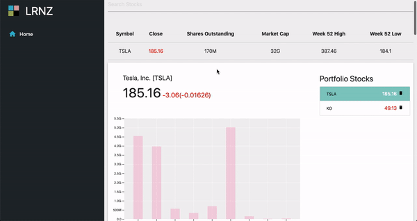

# Desktop Display (in progress)

# Using the app
+ Supply a single stock ticker such as: TSLA, AAPL, IBM, etc...
+ Each query will return a graph, common stock metrics, and current news related to each stock.
+ Each result will be stored, and you'll be able to toggle between all stocks you queried.

# App Errors/Duplicate-Entries
+ __Duplicate-Entries__: If you enter a stock already in state, that stock won't be retrieved.
+ __Errors__: Invalid stock entries will result in an error.

# Reminders
+ Format FinancialsChart & Histogram axes
+ Figure out how to add multiple lines to a FinancialsChart.
+ Start bundle splitting.
+ Ordinal scales in d3: "nice() isn't a method"
    + Look over react components to make sure ordinal scales don't call the method nice().
    + Don't forget to pass in padding argument when calling scaleFinder().getOrdinalScale(padding)

# Disclaimer
+ Not intended to replace a financial advisor
