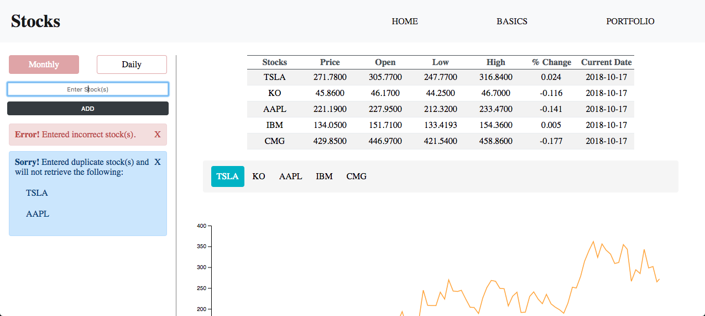
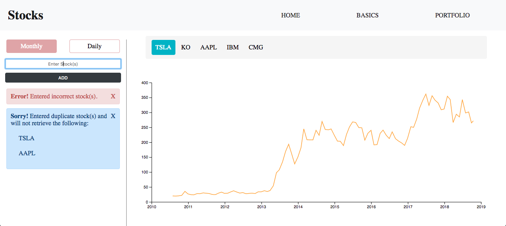
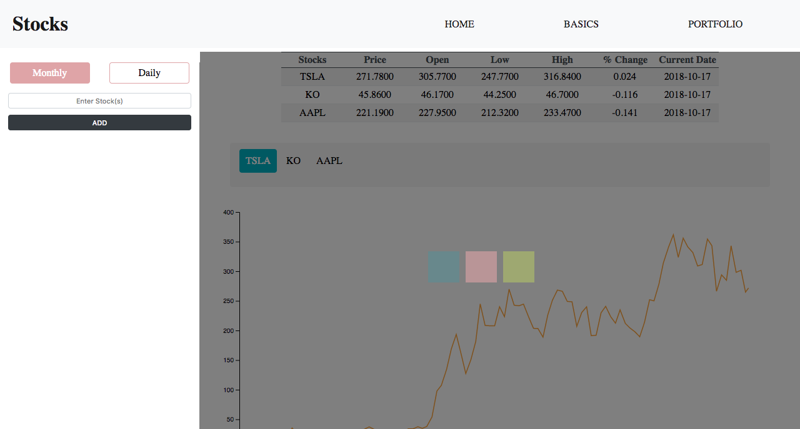
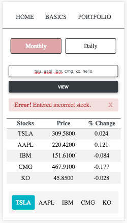
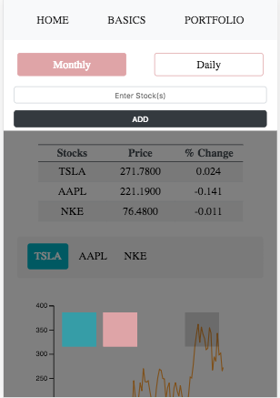

# Desktop display

# Mobile display

# App functionality
+ Query single/multiple stock(s).
+ Each query will show you a table with the latest monthly/daily adjusted price and percent change for each stock.
+ Invalid stock entries will be removed and an error will be thrown.
+ If you make too many consecutive calls, a warning will be thrown instructing you to: "wait a few seconds and try again."

# Using the app
+ Supply a single stock ticker: TSLA.
+ Or supply multiple valid stock tickers seperated by a comma: TSLA, AAPL, IBM, KO ....

# Reminders (so i don't forget)
+ Fix auto generated width/heigth for chart. Currently, works correctly but it needs small tweaks
+ Desktop display sidebar border-right doesn't reach the top. Small gap between sidebar and navbar.
+ Rewrite css for ActiveStock.js selector: top & bottom padding are uneven.
+ Landscape view for mobile devices generates a height that is too small to correctly render the graph. Consider removing graph for landscape view.
+ Implement monthly/daily toggler functionality
