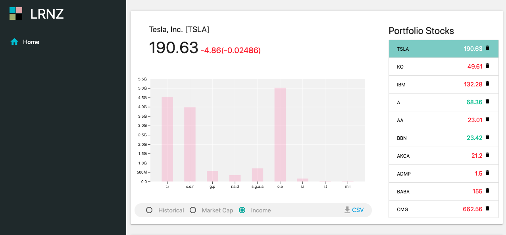
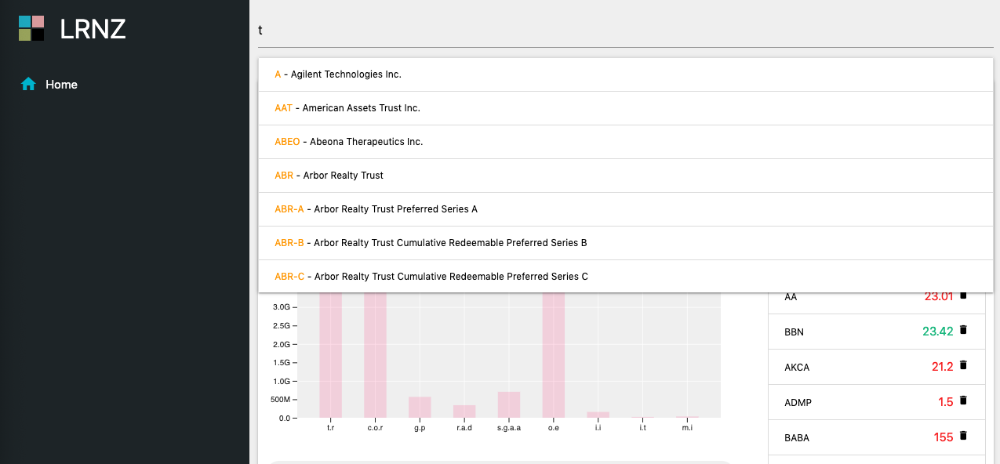
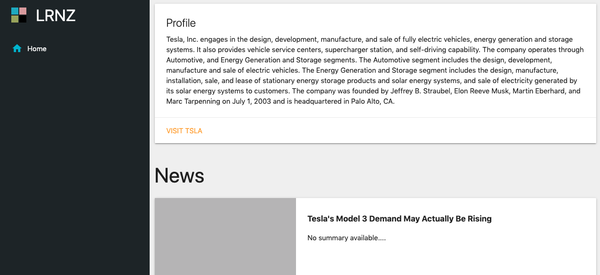

<h1 align="center">Stock Market</h1>

A stock-market dashboard to give you a rough overview of any particular company.

    

# Demo

# Screenshots

# Introduction

- The purpose of this dashboard is to give you a rough overview of any particular company (Please star if you found this repo helpful).

- Six Key Metrics

  - `Stock Price`
  - `Shares Outstanding`
  - `Market Cap` = Stock Price x Shares Outstanding
  - `Total Cash`
  - `Total Debt`
  - `Enterprise Value` = Market Cap - Total Cash + Total Debt

- Historical Chart

  - Displays stock price for the last five years

- Company Description

  - A brief description of the products/services that a company offers

- Company News

  - Lists multiple articles related to current company news

# Disclaimer

- Not intended to replace a financial advisor
