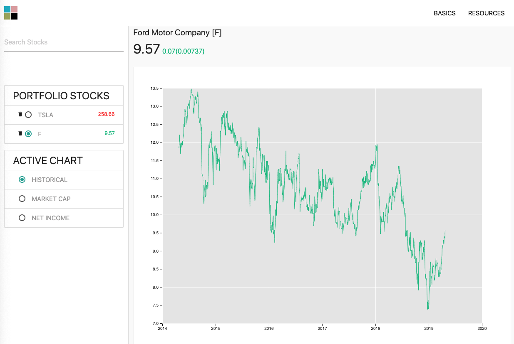

# Securities App

- A prototype of a stock-market data dashboard

# Demo (current iteration)

# Introduction

- The purpose of this dashboard is to give you a rough overview of any particular company.

- Six Key Metrics

  - Report Date
  - Stock Price
  - Shares Outstanding
  - Market Cap = Stock Price x Shares Outstanding
  - Total Cash
  - Total Debt
  - Enterprise Value = Market Cap - Total Cash + Total Debt

- Historical Chart

  - Displays stock price for the last five years

- Company Description

  - A brief description of the products/services that a company offers

- Company News
  - Lists multiple articles related to current company news

# Next Iteration (currently under development)

# Disclaimer

- Not intended to replace a financial advisor
