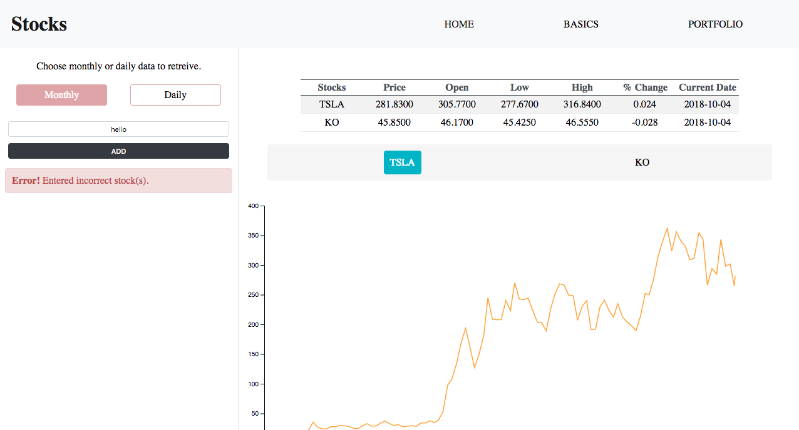

# Desktop display

# Mobile display

# App functionality
+ Query single/multiple stock(s).
+ Each query will show you a table with the latest monthly/daily adjusted price and percent change for each stock.
+ Invalid stock entries will be removed and an error will be thrown.
+ If you make too many consecutive calls, a warning will be thrown instructing you to: "wait a few seconds and try again."

# Using the app
+ Supply a single stock ticker: TSLA.
+ Or supply multiple valid stock tickers seperated by a comma: TSLA, AAPL, IBM, KO ....
